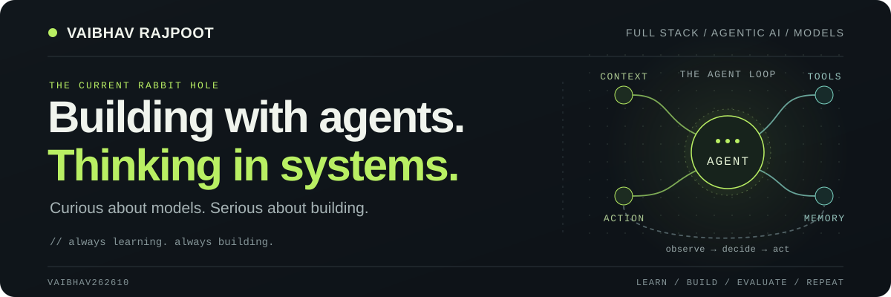

<picture>
  <source media="(prefers-color-scheme: dark)" srcset="./assets/banner-dark.svg">
  <source media="(prefers-color-scheme: light)" srcset="./assets/banner-light.svg">
  
</picture>

  <b>Full Stack Developer · Agentic AI · Language Models</b>

  <a href="https://vaibhavrajpoot.me">Website</a>
  &nbsp; / &nbsp;
  <a href="https://linkedin.com/in/vaibhavrajpoot">LinkedIn</a>
  &nbsp; / &nbsp;
  <a href="https://instagram.com/vaibhavrajpoott">Instagram</a>
  &nbsp; / &nbsp;
  <a href="https://wakatime.com/@e7caf7d2-4af3-48ea-94f0-0c006fd14f3f">Code time</a>

## A little context

I'm **Vaibhav Rajpoot**, a full stack developer with a focus on **agentic AI, language models, and AI systems**.

I'm curious about both the model and the software around it: how models behave, how agents use tools, how context changes the result, and how all of that becomes a useful product.

I like turning questions into experiments, and experiments into things people can use.

**Current loop:** learn → experiment → build → evaluate → repeat.

## What has my attention

| Focus | What I'm digging into |
| :--- | :--- |
| **Agentic systems** | Planning, tool calling, orchestration, and feedback loops. |
| **Language models** | LLMs, model behavior, reasoning, and inference tradeoffs. |
| **Context & knowledge** | Retrieval, memory, grounding, and context design. |
| **AI engineering** | Evaluation, observability, and useful full stack AI products. |

## The toolkit

| Layer | Technologies |
| :--- | :--- |
| **Languages** | `Python` · `TypeScript` · `JavaScript` |
| **Frontend** | `React` · `Next.js` · `Tailwind CSS` |
| **Backend** | `Node.js` · `Express` · `Socket.io` |
| **Data** | `MongoDB` · `MySQL` |
| **Cloud** | `AWS` · `Firebase` |

[Explore my repositories →](https://github.com/Vaibhav262610?tab=repositories)

---

  <i>Still married to JavaScript. Now with an AI subplot.</i>

